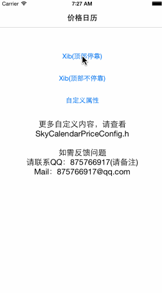

#SkyCalendarPriceView

-----
##测试环境：Xcode 6，iOS 7.0以上。

##简介
一个可以自定义样式的价格日历

* 高度封装，简单使用，传入对应的数据模型即可显示
* 灵活度高，大部分view的样式可调整
* 显示的文字可自定义处理，也可以自定义和系统处理一起使用
* 可在Xib或StoryBoard中拖拽使用，也支持自动布局，也可以手写固定的Frame
* 支持旋屏

-----
##使用方法
把头文件 `SkyCalendarPriceView.h` 导入项目。
```objc
	#import "SkyCalendarPriceView.h"
```
###基本使用
```objc
	// 创建价格日历
	SkyCalendarPriceView *v = [SkyCalendarPriceView calendarPriceView];
    // 创建数据模型
    SkyCalendarPriceModel *model = [SkyCalendarPriceModel calendarPriceModelWithYear:@(2015) withMonth:@(3) withDay:@(22) withPrice:@(30) withCount:@(10)];
    SkyCalendarPriceModel *model2 = [SkyCalendarPriceModel calendarPriceModelWithYear:@(2015) withMonth:@(9) withDay:@(22) withPrice:@(10) withCount:@(10)];
    SkyCalendarPriceModel *model3 = [SkyCalendarPriceModel calendarPriceModelWithYear:@(2015) withMonth:@(7) withDay:@(24) withPrice:@(20) withCount:@(10)];
    // 导入数据模型
    _v.datas = @[model, model2, model3];
    // 设置今天的时间，可不设置
    _v.today = [NSDate date];
```
###定制样式
详情请看[SkyCalendarPriceViewConfig.h](SkyCalendarPriceView/SkyCalendarPriceViewConfig.h)

###代码修改部分view样式
```objc
	// 可通过调用以下几个方法
	
	SkyCalendarHeader
	+ (void)SkyCalendarPriceViewInitHeaderViewOfYearMonthViewStyleWithBlock:(void(^)(UIView *view))block
	+ (void)SkyCalendarPriceViewInitHeaderViewOfWeekLabelsStyleWithBlock:(void(^)(NSArray *labels))block;
	
	SkyCalendarCell
	+ (void)SkyCalendarPriceViewInitCellStyleWithBlock:(void(^)(UICollectionViewCell *cell))block;
```

###自定义显示的数据样式
```objc
	// 通过实现SkyCalendarPriceViewDelegate的方法进行显示自定义的数据样式
	- (NSDictionary*)skyCalendarPriceView:(SkyCalendarPriceView*)cview cellDataStringDictionaryWithIndexPath:(NSIndexPath*)indexPath withYear:(NSString*)year withMonth:(NSString*)month withDay:(NSString*)day withPrice:(NSString*)price withCount:(NSString*)count withIsToday:(BOOL)isToady;
	- (NSString*)skyCalendarPriceView:(SkyCalendarPriceView*)cview cellDayStringWithYear:(NSString*)year withMonth:(NSString*)month withDay:(NSString*)day withIsToday:(BOOL)isToday;
	- (NSString*)skyCalendarPriceView:(SkyCalendarPriceView *)cview headerLabelStringWithYear:(NSString*)year withMonth:(NSString*)month;
```

###若不需要header停留在顶部
```objc
	// 更换默认布局（注:Xib或StoryBoard中，需手动在代码或面板里设置Layout，设置的Layout需要为UICollectionViewFlowLayout的子类）
	skyCalendarPriceView.collectionViewLayout = [UICollectionViewFlowLayout new];
```

###监听选中/取消选中日期
```objc
	// 通过实现SkyCalendarPriceViewDelegate的方法进行监听
	- (BOOL)skyCalendarPriceView:(SkyCalendarPriceView*)cview shouldSelectIndexWithPriceModel:(SkyCalendarPriceModel*)model;
	- (void)skyCalendarPriceView:(SkyCalendarPriceView*)cview didUnselectIndexWithPriceModel:(SkyCalendarPriceModel*)model;
```

-----
##关于我
* 一枚普通的即将大三的珠海大学生
* 希望大三实习、毕业的工作地方都在珠海

-----
##联系方式
* QQ：875766917，请备注
* Mail：875766917@qq.com

-----
##开源协议（License）
Apache-2.0